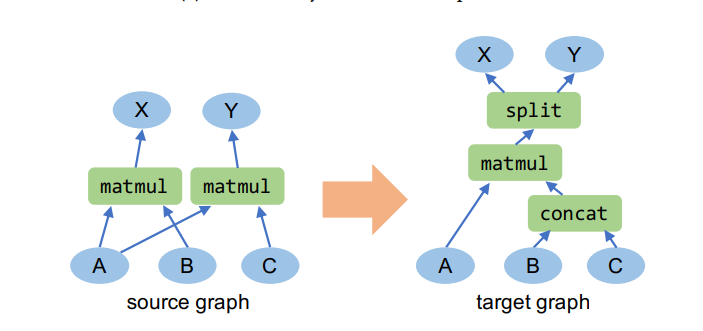

# CS257 Midterm Review
## Recovering TASO substitutions under bounded rewrite closure of axioms

**Team**
- Pietro Marsella — marsella@stanford.edu
- Bödö Wirth — bodow@stanford.edu

**Project option**: Option 2 (research)

---

## TASO
- TASO generates graph substitutions from axioms via enumerate + fuzz + SMT.
- Hypothesis: TASO’s discovered substitutions are (mostly?) in the **bounded rewrite closure** of the axioms.
- For each TASO substitution `src ⇒ dst`, search for a bounded axiom-only derivation `src ->* dst`.
- If found, the rewrite trace is a constructive proof (composition of axioms).

---

---

## IR, matching
- IR (symbolic, no shapes/cost): SSA-style term graph:
  - `Graph` is a set of bindings `t = Expr(t1, …)` (DAG; supports sharing; multiple outputs).
  - outputs are tensors not used by any other expression.
- Rewrite representation:
  - `(srcGraph, dstGraph, inputMap, outputMap)` with explicit I/O tensor correspondence.
- Params are terms (var or literal): kernel/stride/pad/activation/axis/scalars.
- Matching enumerates all consistent unifiers:
  - `match :: Graph -> Rewrite -> [Match]`

---

## Apply, bounded search
- Applying a rewrite:
  - `apply :: Graph -> Rewrite -> Match -> Graph`
  - remove matched tensors, but keep shared internal nodes still referenced outside.
  - add `dst` bindings; rename internal `dst` tensors with fresh names (`r0`, `r1`, …).
  - redirect outputs according to `outputMap`.
- Proof search:
  - `bfs :: [Rewrite] -> Graph -> Graph -> Int -> Maybe Derivation`

---

## Evaluation + preliminary results
- Current coverage: recovered **485 / 568** TASO substitutions.

**Issues**
- Bidirectional rewrites can explode the search space (e.g. `x -> x.T.T`).
- Some reverse directions effectively require fresh tensors; need disciplined invertibility.

**TL**
- Pietro: remaining matching/apply corner cases + bidirectional rewrite policy.
- Bodo: closure enumeration (size/depth bounds) + sparsifier experiments + eval automation.
- Both: final report + artifact once coverage stabilizes.
